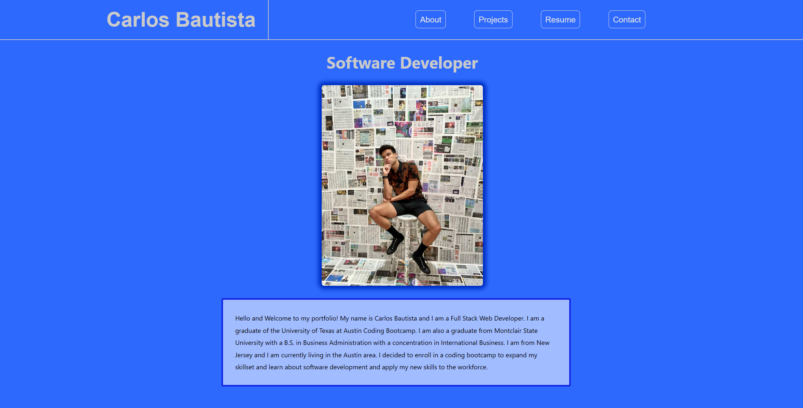

# CxLos20-React-Portfolio

## Description
```
My motivation in building this application was to create an appealing portfolio that reflects my skills and education, so that I can quickly get a new job working in the tech field. I built this project because having an attention-grabbing portfolio that showcases your skills and achievements is crucial for future employers to see. This portfolio aims to solve the problem of not having an organized location to showcase all my work. Building this application, I learned a lot about React. I learned the syntax and folder structure and how it differs from vanilla JavaScript.
```
## Table of Contents 
	
- [Installation](#installation)
- [Usage](#usage)
- [Credits](#credits)
- [License](#license)
- [Badges](#badges)
- [Features](#features)
- [Tests](#tests)


## Installation

N/A

## Usage

[My Portfolio](https://cxlos.github.io/CxLos20-React-Portfolio/)



## Badges

N/A

## Features

N/A

## How to Contribute

N/A

## Tests

N/A

## Credits

N/A

## License

MIT License

Copyright (c) 2022 CxLos

Permission is hereby granted, free of charge, to any person obtaining a copy
of this software and associated documentation files (the "Software"), to deal
in the Software without restriction, including without limitation the rights
to use, copy, modify, merge, publish, distribute, sublicense, and/or sell
copies of the Software, and to permit persons to whom the Software is
furnished to do so, subject to the following conditions:

The above copyright notice and this permission notice shall be included in all
copies or substantial portions of the Software.

THE SOFTWARE IS PROVIDED "AS IS", WITHOUT WARRANTY OF ANY KIND, EXPRESS OR
IMPLIED, INCLUDING BUT NOT LIMITED TO THE WARRANTIES OF MERCHANTABILITY,
FITNESS FOR A PARTICULAR PURPOSE AND NONINFRINGEMENT. IN NO EVENT SHALL THE
AUTHORS OR COPYRIGHT HOLDERS BE LIABLE FOR ANY CLAIM, DAMAGES OR OTHER
LIABILITY, WHETHER IN AN ACTION OF CONTRACT, TORT OR OTHERWISE, ARISING FROM,
OUT OF OR IN CONNECTION WITH THE SOFTWARE OR THE USE OR OTHER DEALINGS IN THE
SOFTWARE.
